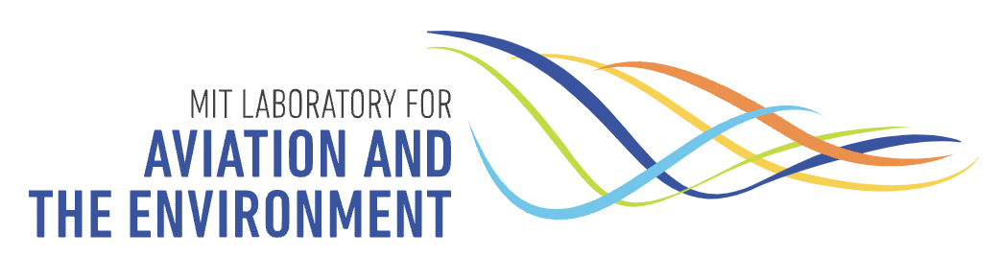

My name is Kexin Zhang. 
I am a PostDoc at the [Grigorieff lab](https://grigoriefflab.umassmed.edu/) at UMass Chan Medical School.
Previously, I worked with [Aaron Frank](https://www.linkedin.com/in/aaron-frank-9801ab17) at the Unversity of Michigan-Ann Arbor.
You can find more about my research [here](https://kekexinz.github.io/research/).

<!--  -->
<!--  -->
<!--  -->
<!--  -->

<!--  -->
<!--  -->

My research areas include:

* AI-driven and differentiable algorithms for cryo-EM
* High-resolution high-throughput visual proteomics
* Computational structural biology and drug discovery
  

<!-- [Erdos number:](https://mathscinet.ams.org/mathscinet/collaborationDistance.html) 4

[Einstein number:](https://mathscinet.ams.org/mathscinet/collaborationDistance.html?group_source=62280) 5 -->

<!--  -->