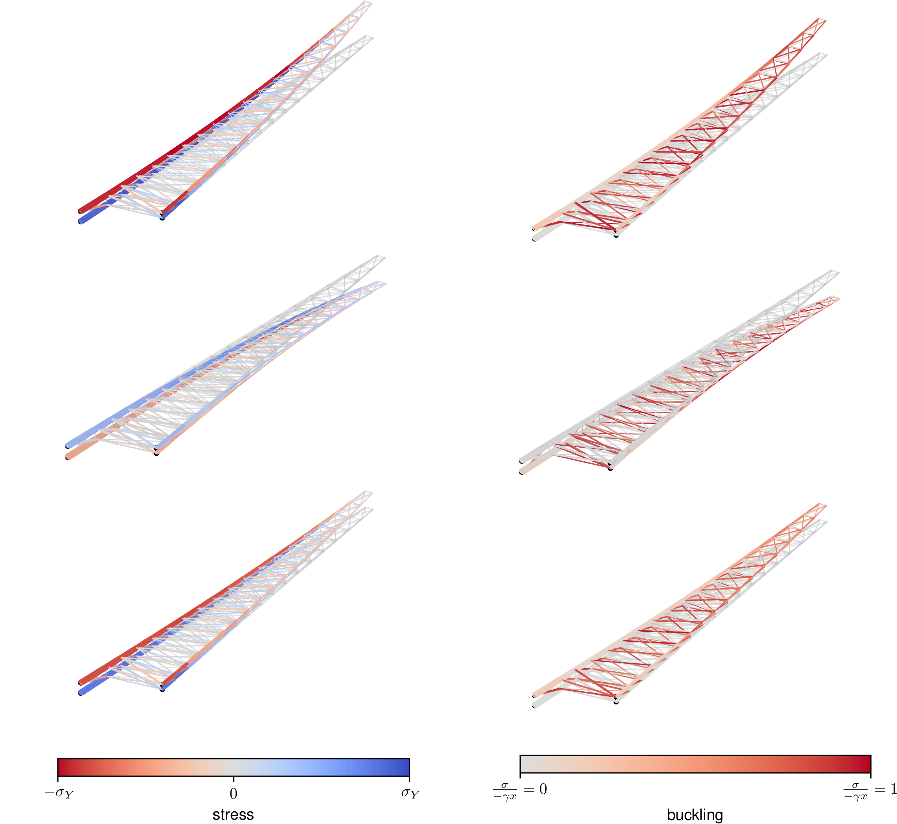
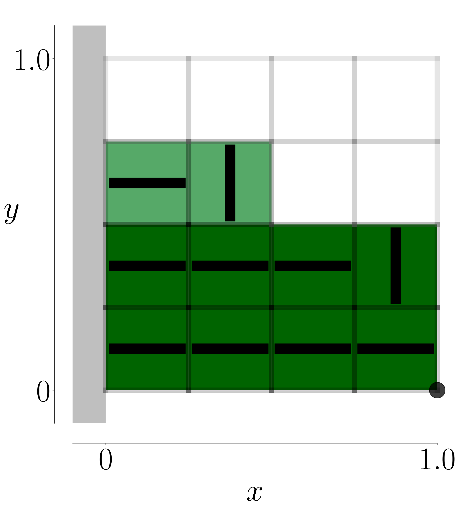
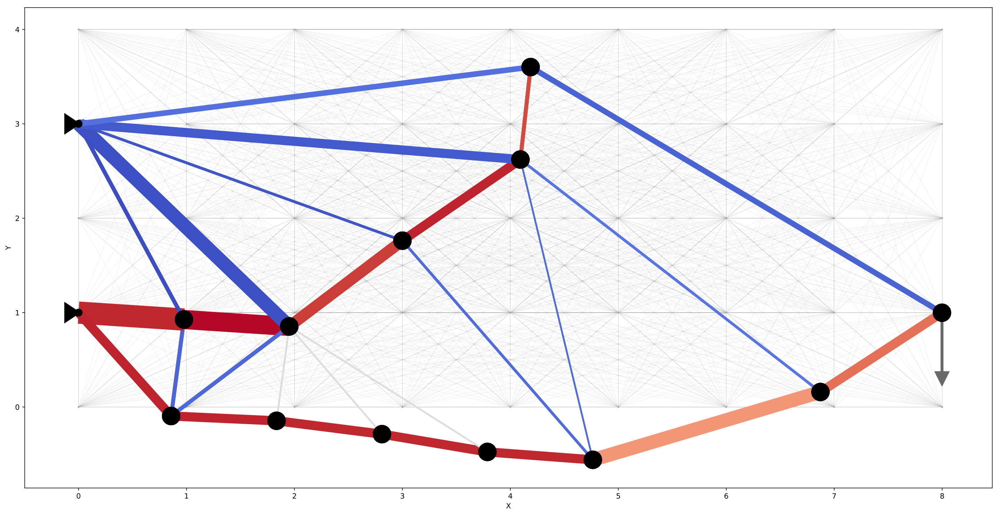
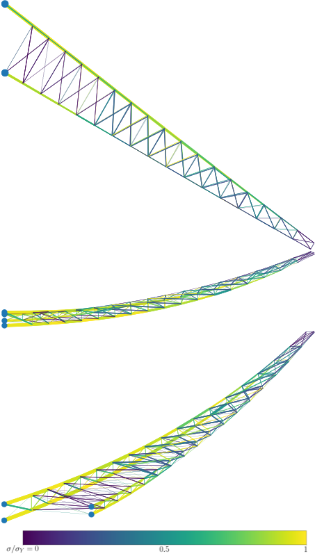
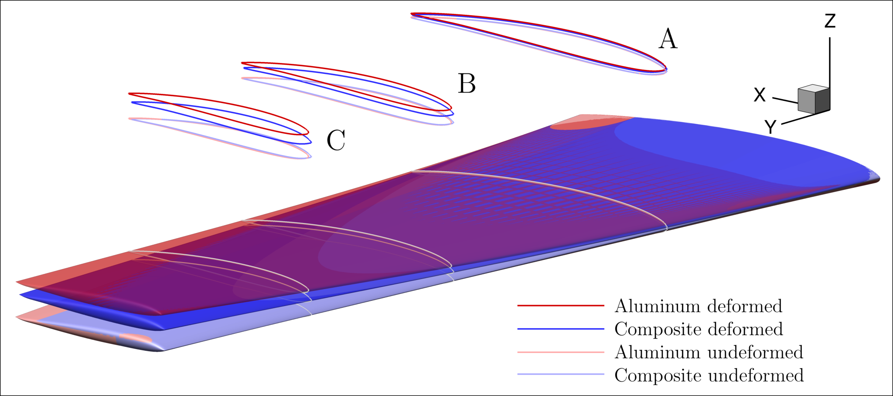
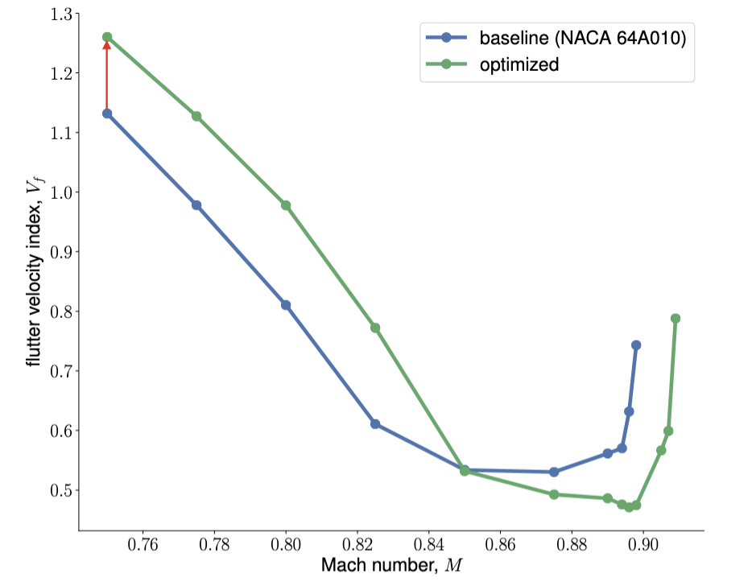
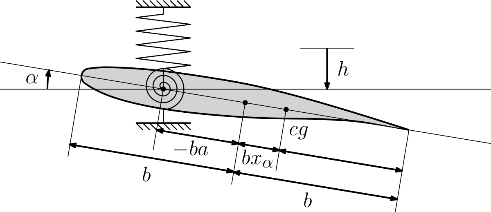
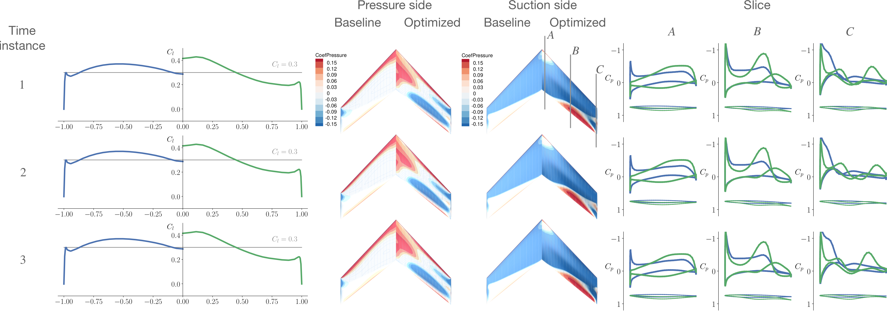

## Journal articles

|        | Title |
|   :-:    | -       |
|  | __Sicheng He__, Eirikur Jonsson, and joaquim R. R. A. Martins.     [__Derivatives for Eigenvalues and Eigenvectors via Analytic Reverse Algorithmic Differentiation__](https://arc.aiaa.org/doi/abs/10.2514/1.J060726?journalCode=aiaaj)     _AIAA Journal_ (In press).|
|  | Ramin Fakhimi, Mohammad Shahabsafa, Weiming Lei, __Sicheng He__, Joaquim R. R. A. Martins, Luis Zuluaga, and Tamas Terlaky.     [__Discrete multi-load truss sizing optimization: model analysis and computational experimentss__](https://link.springer.com/article/10.1007/s11081-021-09672-6)     _Optimization and Engineering_ (2021).|
|  | __Sicheng He__, Eirikur Jonsson, Charles A. Mader, and Joaquim R. R. A. Martins.    [__Coupled Newton–Krylov timespectral solver for flutter and limit cycle oscillation prediction__](https://arc.aiaa.org/doi/10.2514/1.J059224)     _AIAA Journal_ (2021).|
|  | __Sicheng He__, Mohammad Shahabsafa, Weiming Lei, Ali Mohammad-Nezhad, Tamas Terlaky, Luis Zuluaga, and Joaquim R. R. A. Martins.    [__Mixed-integer second-order cone optimization for composite discrete ply-angle and thickness topology optimization problems__](https://link.springer.com/article/10.1007/s11081-020-09573-0)     _Optimization and Engineering_ (2020).|
|  | Mohammad Shahabsafa, Ramin Fakhimi, Weiming Lei, __Sicheng He__, Luis Zuluaga, Joaquim R. R. A. Martins, and Tamas Terlaky.    [__Truss topology design and sizing optimization with guaranteed kinematic stability__](https://link.springer.com/article/10.1007/s00158-020-02698-xs)     _Structural and Multidisciplinary Optimization_ (2020).|
|  | Yayun Shi, Charles A. Mader, __Sicheng He__, Gustavo L. O. Halila, and Joaquim R. R. A. Martins.    [__Natural laminarflow airfoil optimization design using a discrete adjoint approach__](https://arc.aiaa.org/doi/10.2514/1.J058944s)     _AIAA Journal_ (2020).|
|  | Mohamed Amine Bouhlel, __Sicheng He__, and Joaquim R. R. A. Martins.    [__Scalable gradient-enhanced artificial neural networks for airfoil shape design in the subsonic and transonic regimes__](https://link.springer.com/article/10.1007/s00158-020-02488-5)     _Structural and Multidisciplinary Optimization_ (2020). (Webfoil)|
|  | Jichao Li, __Sicheng He__, and Joaquim R. R. A. Martins.    [__Data-driven constraint approach to ensure low-speed performance in transonic aerodynamic shape optimization__](https://www.sciencedirect.com/science/article/pii/S1270963819304912)     _Aerospace Science and Technology_ (2019).|
|  | Mohammad Shahabsafa, Ali Mohammad-Nezhad, Tamas Terlaky, Luis Zuluaga, __Sicheng He__, John T. Hwang, and Joaquim R. R. A. Martins.    [__A novel approach to discrete truss design problems using mixed integer neighborhood search__](https://link.springer.com/article/10.1007/s00158-018-2099-8)     _Structural and Multidisciplinary Optimization_ (2018).|

## Conference proceedings

|        | Title |
|   :-:    | -       |  
|  | Denis-Gabriel Caprace, Adam Cardoza, Teagan Nakamoto, Andrew Ning, Marco Mangano, __Sicheng He__, and Joaquim R. R. A. Martins.    [__Incorporating high-fidelity aerostructural analyses in wind turbine rotor optimization__](https://arc.aiaa.org/doi/abs/10.2514/6.2022-1290).    _In AIAA Scitech, San Diego, CA, January 2022. American Institute of Aeronautics and Astronautics_.|
|  | Marco Mangano, __Sicheng He__, Denis-Gabriel Caprace, Yingqian Liao, and Joaquim R. R. A. Martins.    [__Passive aeroelastic tailoring of large wind turbines using high-fidelity multidisciplinary design optimization__](https://arc.aiaa.org/doi/abs/10.2514/6.2022-1289).    _In AIAA Scitech, San Diego, CA, January 2022. American Institute of Aeronautics and Astronautics_.|
|  | Yingqian Liao, __Sicheng He__, Joaquim R. R. A. Martins, and Yin Lu Young.    [__Hydrostructural optimization of generic composite hydrofoils__](https://arc.aiaa.org/doi/10.2514/6.2020-0164).    _In AIAA SciTech Forum, Orlando, FL, January 2020. AIAA_.|
|  | __Sicheng He__, Eirikur Jonsson, Charles A. Mader, and Joaquim R. R. A. Martins.    [__A coupled Newton–Krylov time-spectral solver for wing flutter and LCO prediction__](https://arc.aiaa.org/doi/10.2514/6.2019-3549).    _In AIAA Aviation Forum, Dallas, TX, June 2019_. (Best student paper award, 2nd place)|
|  |__Sicheng He__, Eirikur Jonsson, Charles A. Mader, and Joaquim R. R. A. Martins.    [__Aerodynamic shape optimization with time spectral flutter adjoint__](https://arc.aiaa.org/doi/10.2514/6.2019-0697).    _In 2019 AIAA/ASCE/AHS/ASC Structures, Structural Dynamics, and Materials Conference, San Diego, CA, January 2019. American Institute of Aeronautics and Astronautics_.|
|  | __Sicheng He__, Eirikur Jonsson, Charles A. Mader, and Joaquim R. R. A. Martins.    [__A coupled Newton–Krylov time spectral solver for flutter prediction__](https://arc.aiaa.org/doi/10.2514/6.2018-2149).    _In 2018 AIAA/ASCE/AHS/ASC Structures, Structural Dynamics, and Materials Conference, Kissimmee, FL, January 2018. American Institute of Aeronautics and Astronautics_.|

## Thesis

|        | Title |
|   :-:    | -       |  
|  | __Sicheng He__. ["Aerodynamic Shape Optimization using a Time-Spectral Approach for Limit Cycle Oscillation Prediction."](https://deepblue.lib.umich.edu/handle/2027.42/167969) PhD diss., 2020.