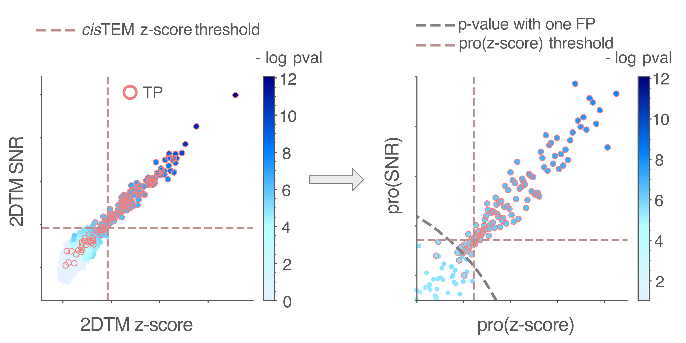

## Preprints and work in preparation
|        |  |
|   :-:    | -       |  
|  | __Kexin Zhang__, Nikolaus Grigorieff.     __Improved Cryo-EM Reconstruction of Sub-50 kDa Complexes Using 2D Template Matching__     _In preparation (2025)_. No link available yet. |
|  | Aaditya V. Rangan, Wai-Shing Tang, Pilar Cossio, __Kexin Zhang__, Nikolaus Grigorieff.     [__Estimating the tails of the spectrum of the Hessian of the log-likelihood for ab-initio single-particle reconstruction in electron cryomicroscopy__](https://arxiv.org/abs/2411.13263v1)     _arXiv_ (2024).|

## Journal articles

|        |  |
|   :-:    | -       |
|  | __Kexin Zhang__, Pilar Cossio, Aaditya V. Rangan, Bronwyn A. Lucas, Nikolaus Grigorieff.     [__A New Statistical Metric for Robust Target Detection in Cryo-EM Using 2D Template Matching__](https://www.biorxiv.org/content/10.1101/2024.10.01.616095v1)     _IUCrJ_ (2025).|
|  | Bronwyn A. Lucas*, __Kexin Zhang__, Sarah Loerch, Nikolaus Grigorieff*.    [__In situ single particle classification reveals distinct 60S maturation intermediates in cells__](https://elifesciences.org/articles/79272.)     _eLife_ (2022).|
|  | __Kexin Zhang__, Kyrillos Abdallah, Pujan Ajmera, Kyle Finos, Andrew Looka, Joseph Mekhael, Aaron T. Frank*.     [__CS-Annotate: A Tool for Using NMR Chemical Shifts to Annotate RNA Structure__](https://pubs.acs.org/doi/10.1021/acs.jcim.1c00006#:~:text=At%20its%20core%2C%20CS-Annotate,from%20their%20chemical%20shift%20fingerprint.)     _Journal of Chemical Information and Modeling_ (2021).|
|  | __Kexin Zhang__, Aaron T. Frank*.     [__Probabilistic Modeling of RNA Ensembles Using NMR Chemical ShiftsArticle__](https://pubs.acs.org/doi/10.1021/acs.jpcb.1c05651)     _The Journal of Physical Chemistry B_ (2021).|
|  | Jingru Xie, __Kexin Zhang__, Aaron T. Frank*.    [__Pyshifts: a PyMOL plugin for chemical shift-based analysis of biomolecular ensembles__](https://doi.org/10.1021/acs.jcim.9b01039.)     _Journal of Chemical Information and Modeling_ (2020).|
|  | __Kexin Zhang__, Hao Huang, Hsiang-Chieh Hung, Chuan Leng, Shuai Wei, Ralph Crisci, Shaoyi Jiang*, Zhan Chen*.    [__Strong hydration at the poly (ethylene glycol) brush/albumin solution interface__](https://doi.org/10.1021/acs.langmuir.9b03680.)     _Langmuir_ (2020).|
|  | Chelsey A. Del Grosso, Chuan Leng, __Kexin Zhang__, Hsiang-Chieh Hung, Shaoyi Jiang*, Zhan Chen*, Jonathan J. Wilker*.    [__Surface hydration for antifouling and bio-adhesion__](https://doi.org/10.1039/D0SC03690K.)     _Chemical Science_ (2020).|
|  | __Kexin Zhang__, Aaron T. Frank*.     [__Conditional Prediction of Ribonucleic Acid Secondary Structure Using Chemical Shifts__](https://pubs.acs.org/doi/full/10.1021/acs.jpcb.9b09814)     _The Journal of Physical Chemistry B_ (2019).|
|  | Chuan Leng, Hao Huang, __Kexin Zhang__, Hsiang-Chieh Hung, Yao Xu, Yaoxin Li, Shaoyi Jiang*, Zhan Chen*.    [__Effect of surface hydration on antifouling properties of mixed charged polymers__](https://doi.org/10.1021/acs.langmuir.8b00768.)     _Langmuir_ (2018).|
|  | Chuan Leng, Shuwen Sun, __Kexin Zhang__, Shaoyi Jiang*, Zhan Chen*.    [__Molecular level studies on interfacial hydration of zwitterionic and other antifouling polymers in situ__](https://doi.org/10.1016/j.actbio.2016.02.030.)     _Acta Biomaterialia_ (2016).|
|  | Chen Wang, Yue Zhou, __Kexin Zhang__, Xingguo Nie, Xinghua Xia*.    [__Fast and sensitive detection of protein concentration in mild environments__](https://doi.org/10.1016/j.talanta.2014.12.046.)     _Talanta_ (2015).|

## Thesis

__Kexin Zhang__. ["Multiscale Modeling of RNA Structures Using NMR Chemical Shifts."](https://deepblue.lib.umich.edu/handle/2027.42/163247) PhD diss., 2020.