Table of content
- [Research vision](#research-vision)
- [Research projects](#research-projects)
  - [1. MDO with general dynamical systems and control](#1-mdo-with-general-dynamical-systems-and-control)
  - [2. Aeroelastic optimization](#2-aeroelastic-optimization)
  - [3. Machine learning in aerodynamic shape optimization](#3-machine-learning-in-aerodynamic-shape-optimization)
  - [4. Offshore Wind turbine aerostructural optimization](#4-offshore-wind-turbine-aerostructural-optimization)
  - [5. Aerodynamic shape optimization with laminar-turbulent transition model](#5-aerodynamic-shape-optimization-with-laminar-turbulent-transition-model)
  - [6. Structural global optimization using mixed integer linear and second order cone programming](#6-structural-global-optimization-using-mixed-integer-linear-and-second-order-cone-programming)

# Research vision
I design efficient and environmentally friendly aircraft by developing efficient algorithms and code implementation. 
I conduct interdisciplinary research--the three domains I have been researching are multidisciplinary design optimization (MDO), dynamical system and control, and machine learning. 
In my research, I develop new theories to convert previously untackled dynamical systems and control optimization problems into a computationally efficient formulation. 
Leveraging the new theory, I develop programs to solve problems on a large scale using high-fidelity physical models. 
Using high-fidelity physical model data, I train machine learning models to expedite simulation and design optimization.
The unique combination of high-fidelity models and dynamical systems and control of my research can potentially make an impact in fields including aerospace, wind energy, robotics, and automobile industries.

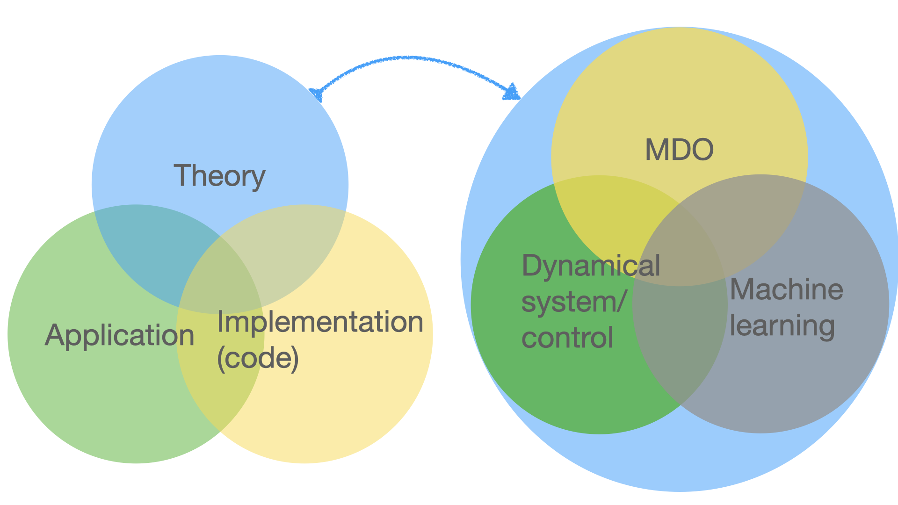

The research vision that differentiates me from other labs working on MDO is listed below:
1. **(Theory)** MDO shall be enabled to address ever **more complex dynamical systems and control problems** beyond the current focus, i.e., the steady-state problems.
2. **(Implementation/code)** **Efficient and general-purpose codes** for design optimization in dynamical systems and control shall be developed leveraging the abstraction ability of the mathematical representation.
3. **(Application)** I develop **environmentally friendly engineering designs**, such as efficient off-shore wind turbines, and aircraft with less noise and emission, to address critical climate and energy challenges of modern society.

# Research projects

## 1. MDO with general dynamical systems and control

Dynamical systems are universal.
In the past several decades, the MDO community focused on dynamical systems classified as equilibrium points, and little previous research was on bifurcation, LCO, and chaotic systems.
For example, the transonic buffet constraint, a bifurcation triggered by the shock wave and boundary layer interaction, has only recently been modeled using first principles in a high fidelity optimization problem \cite{Thomas2020}.
Also, control theory, as a fundamental discipline in aerospace engineering, has been largely overlooked by the MDO community due to its high computational cost. 
The question I am trying to answer in this research is:
**How can we optimize a general high-fidelity model-based multidisciplinary dynamical system (with or without control) performance?**
With this question successfully answered, a large class of problems can be modeled and solved using MDO. 

This is a very challenging question to answer, because of the model dimensionality (millions of state variables and thousands of design variables).
My research partially answers the question by focusing on developing algorithms scale well with the design variables using the adjoint method.
The key finding of the research is that each dynamical system has its own unique structure and the adjoint method shall be developed leveraging these structures to gain computational efficiency. 
Two highlights of my previous research are: 
1. I developed an algorithm demonstrating that the closed-loop control co-design problem can be solved at a cost independent of the number of design variables. 
Using the algorithm, I optimized the drone aerodynamic shape which **reduces the control cost by about 30%**.
1. I developed a **fundamental** method to discover the reverse algorithmic differentiation formula using the forward algorithmic differentiation formula for complex analytic equation and we are **the first to discover a succint eigenvalue derivative formula for a general complex matrix.

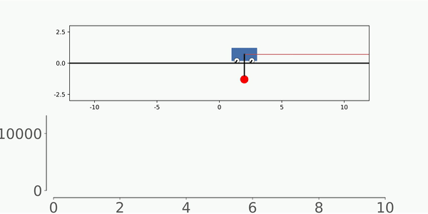

__Publication:__

|        |  |
|   :-:    | -       |  
| 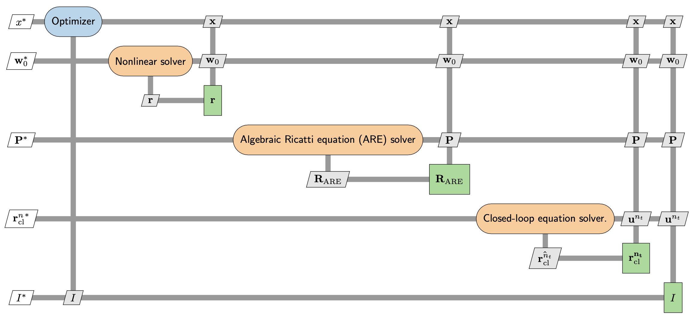 | __Sicheng He__, Shugo Kaneko, Eirikur Jonsson, Marco Mangano, Joaquim R. R. A. Martins.     [__Control co-design sensitivity computation using the adjoint method__](https://www.researchgate.net/publication/362931690_Eigenvalue_problem_derivatives_computation_for_a_complex_matrix_using_the_adjoint_method)     _submitted to SIAM applied dynamics (SIADS)_ (2022).|
| 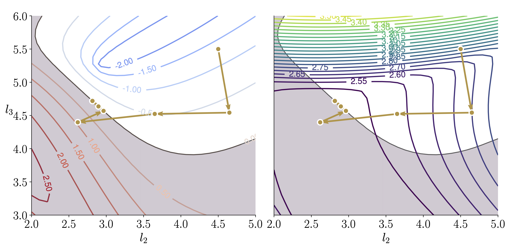 | __Sicheng He__, Eirikur Jonsson, Joaquim R. R. A. Martins.     [__Adjoint-based Linear stability constrained design optimization__](https://www.researchgate.net/publication/362931690_Eigenvalue_problem_derivatives_computation_for_a_complex_matrix_using_the_adjoint_method)     _submitted to SIAM applied dynamics (SIADS)_ (2022).|
| 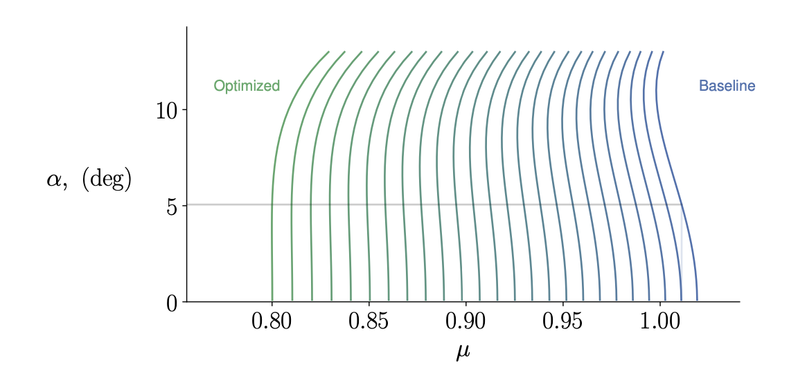 | __Sicheng He__, Eirikur Jonsson, Joaquim R. R. A. Martins.     [__Adjoint-based Limit Cycle Oscillation Instability Sensitivity and Suppression__](https://www.researchgate.net/publication/363581644_Adjoint-based_Limit_Cycle_Oscillation_Instability_Sensitivity_and_Suppression)     _Nonlinear dynamics_ (2022).|
| 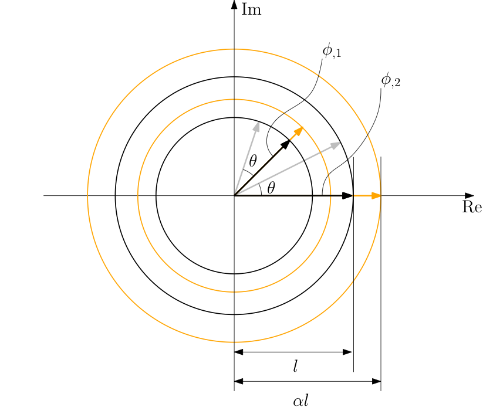 | __Sicheng He__, Yayun Shi, Eirikur Jonsson, Joaquim R. R. A. Martins.     [__Eigenvalue problem derivatives computation for a complex matrix using the adjoint method__](https://www.researchgate.net/publication/362931690_Eigenvalue_problem_derivatives_computation_for_a_complex_matrix_using_the_adjoint_method)     _MSSP (accepted)_ (2023).|
| 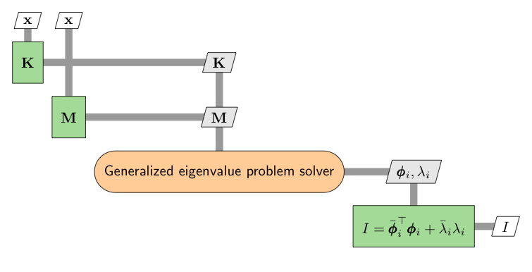 | __Sicheng He__, Eirikur Jonsson, and joaquim R. R. A. Martins.     [__Derivatives for Eigenvalues and Eigenvectors via Analytic Reverse Algorithmic Differentiation__](https://arc.aiaa.org/doi/abs/10.2514/1.J060726?journalCode=aiaaj)     _AIAA Journal_ (2022).|

## 2. Aeroelastic optimization
The next-generation aircraft are trending with more flexible wings.
This makes the aircraft wings more susceptible to flutter.
However, the state-of-art MDO problem formulation usually only includes a steady-state aerostructure module and rarely a low-fidelity flutter module.
The missing or inaccurate flutter modeling in the aircraft conceptual design stage may cause costly redesign if the flutter is found in a later stage.
The fundamental question that I want to answer is that:
**How to design the future aircraft free from flutter?**
Answering this question, the aircraft designs generated from MDO will be much more realistic.

This project is closely related to the previous project because the aeroelastic problem is categorized as an LCO problem from the perspective of dynamical system theory.
To answer the question, we developed novel algorithms using time spectral method, Newton--Krylov method, and the coupled adjoint method to obtain good scalability with respect to both state and design variables.
The key finding of the research is that for LCO problem, it has a unique problem structure that shall be exploited by the solver to obtain the best computational performance.
Using our proposed methods, we obtain **the-first-of-it-kind** high-fidelity CFD-based aerodynamic shape optimization for a wing using the time-spectral method that improves the flutter speed by 118%.
This is my Ph.D. project. 
I was awarded an AIAA Aviation Conference **best student paper award**.

|        |  |
|   :-:    | -       |  
|  | __Sicheng He__, Eirikur Jonsson, Joaquim R. Martins.    [__Wing Aerodynamic Shape Optimization with Time Spectral Limit-Cycle Oscillation Adjoint__](https://arc.aiaa.org/doi/abs/10.2514/6.2022-3357).    _In AIAA Aviation, Chicago, IL, June 2022. American Institute of Aeronautics and Astronautics_.|
| 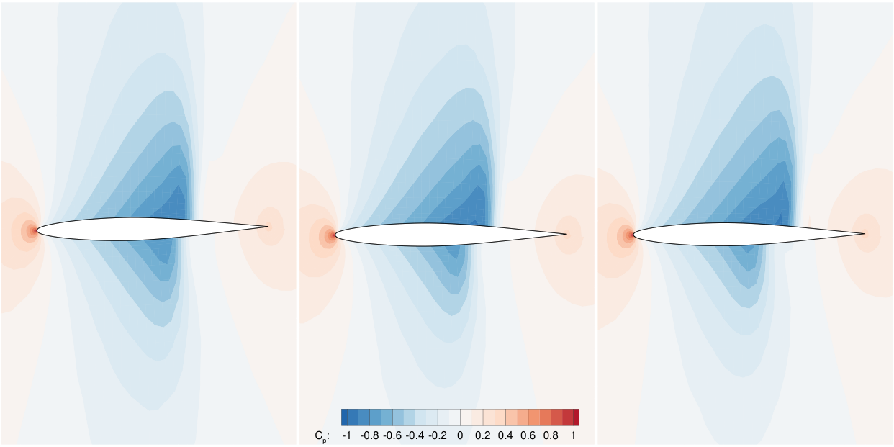 | __Sicheng He__, Eirikur Jonsson, Charles A. Mader, and Joaquim R. R. A. Martins.    [__Coupled Newton–Krylov timespectral solver for flutter and limit cycle oscillation prediction__](https://arc.aiaa.org/doi/10.2514/1.J059224)     _AIAA Journal_ (2021).|
|  | __Sicheng He__, Eirikur Jonsson, Charles A. Mader, and Joaquim R. R. A. Martins.    [__A coupled Newton–Krylov time-spectral solver for wing flutter and LCO prediction__](https://arc.aiaa.org/doi/10.2514/6.2019-3549).    _In AIAA Aviation Forum, Dallas, TX, June 2019_. (Best student paper award, 2nd place)|

## 3. Machine learning in aerodynamic shape optimization

Surrogate models, including the classic and more recent machine learning models, are becoming essential tools for designers because they outperform a direct numerical analysis in speed with similar accuracy,and they can also solve problems without explicit numerical models.
Compared with the classic tools (e.g., the kriging method), machine learning tools (e.g., the deep neural network) suffer less from overfitting and perform better when the data set is large.
With the aforementioned benefits, we want to address the following question in our research:
**How can we accelerate the optimization using machine learning?**

We develop deep neural network-based models to answer this question.
The key finding is that uniformly sampling design space is inefficient.
The design space paramitrization and the sampling shall favor the region with good performance.
As one highlight of the research, we are the first to apply the so-called Sobolev neural network, a gradient-enhanced neural network, to obtain the **state-of-the-art** accurate surrogate model for airfoil aerodynamic parameters, such as lift and drag.
The proposed method enables **real-time** aerodynamic analysis and shape optimization, and it is one of the engines that drive the online airfoil simulation website, [Webfoil](http://webfoil.engin.umich.edu/)
. 

|        |  |
|   :-:    | -       |  
| 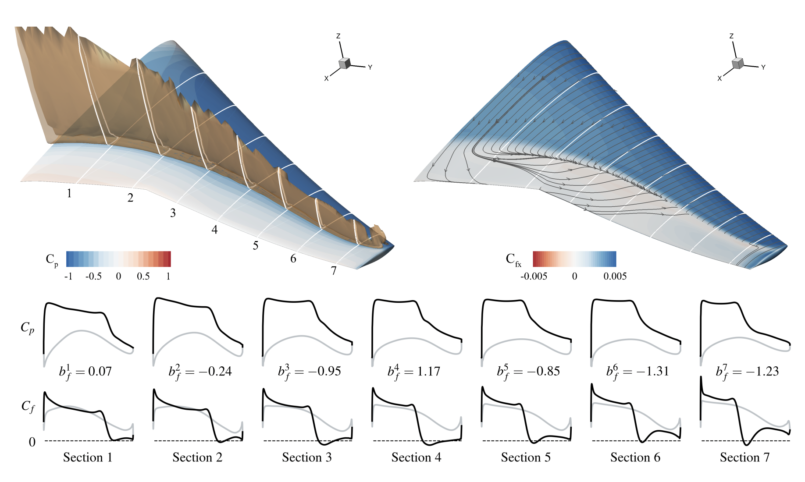 | Jichao Li, __Sicheng He__, Mengqi Zhang, Joaquim R. R. A. Martins, Boo Cheong Khoo.     [__Physics-Based Data-Driven Buffet-Onset Constraint for Aerodynamic Shape Optimization__](https://arc.aiaa.org/doi/10.2514/1.J061519)     _AIAA Journal_ (2022).|
| 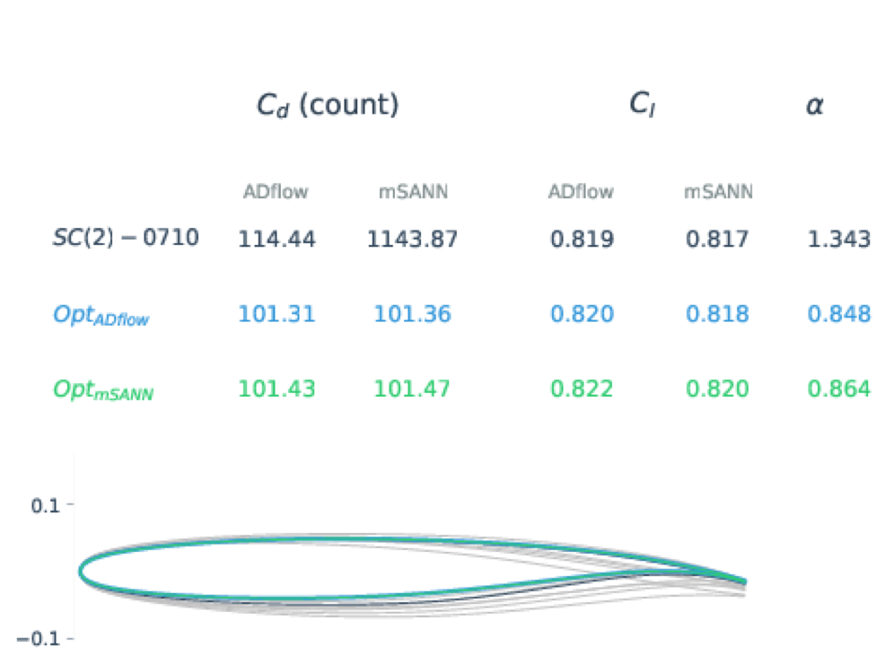 | Mohamed Amine Bouhlel, __Sicheng He__, and Joaquim R. R. A. Martins.    [__Scalable gradient-enhanced artificial neural networks for airfoil shape design in the subsonic and transonic regimes__](https://link.springer.com/article/10.1007/s00158-020-02488-5)     _Structural and Multidisciplinary Optimization_ (2020). (Webfoil)|
| 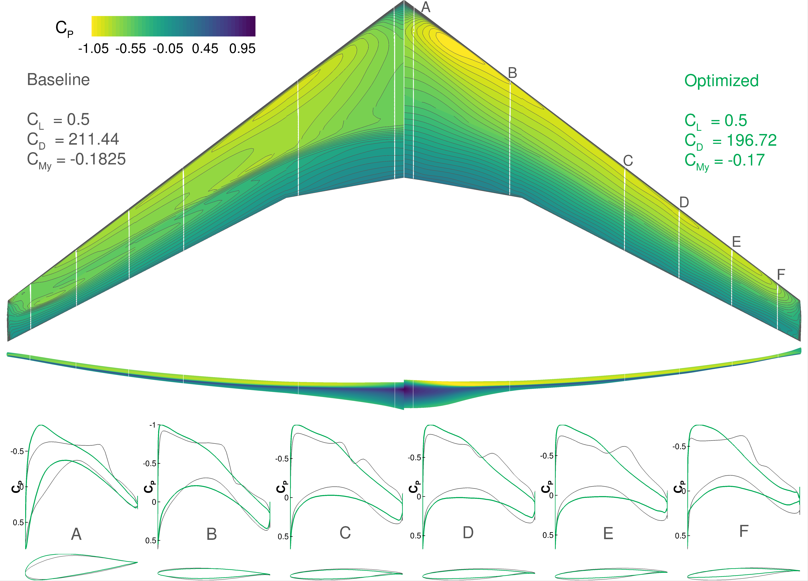 | Jichao Li, __Sicheng He__, and Joaquim R. R. A. Martins.    [__Data-driven constraint approach to ensure low-speed performance in transonic aerodynamic shape optimization__](https://www.sciencedirect.com/science/article/pii/S1270963819304912)     _Aerospace Science and Technology_ (2019).|

## 4. Offshore Wind turbine aerostructural optimization

The state-of-the-art design optimization in the field assumes that the structure is rigid and the coupling between the structure and fluid is neglected.
In effect, such assumptions become problematic as the size of the wind turbine increases to improve efficiency and the structure is becoming more flexible.
In addition, by considering the coupling effect, we can explore a larger design space and design more efficient wind turbines.
In this research, the pressing question we plan to address is: **How can we optimize the wind turbine design with both structural and aerodynamic shape variables and account for their coupling?**

To answer that question, we apply the MDO algorithms together with computational fluid dynamics (CFD) and finite element analysis (FEA) tools. 
The key finding of the research is that the aeroelastic coupling can be exploited to reduce the structure mass by about 2.2% compared with an optimized design without the coupling.
We obtained **the-first-of-it-kind** high-fidelity aerostructural optimization for wind turbines.
We are currently exploring using the composite to obtain passive load alleviation to further improve the performance of the wind turbine designs.

__Publication:__

|        |  |
|   :-:    | -       |  
| 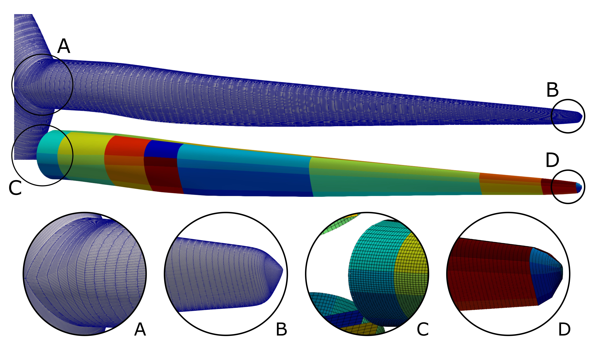 | Denis-Gabriel Caprace, Adam Cardoza, Teagan Nakamoto, Andrew Ning, Marco Mangano, __Sicheng He__, and Joaquim R. R. A. Martins.    [__Incorporating high-fidelity aerostructural analyses in wind turbine rotor optimization__](https://arc.aiaa.org/doi/abs/10.2514/6.2022-1290).    _In AIAA Scitech, San Diego, CA, January 2022. American Institute of Aeronautics and Astronautics_.|
| 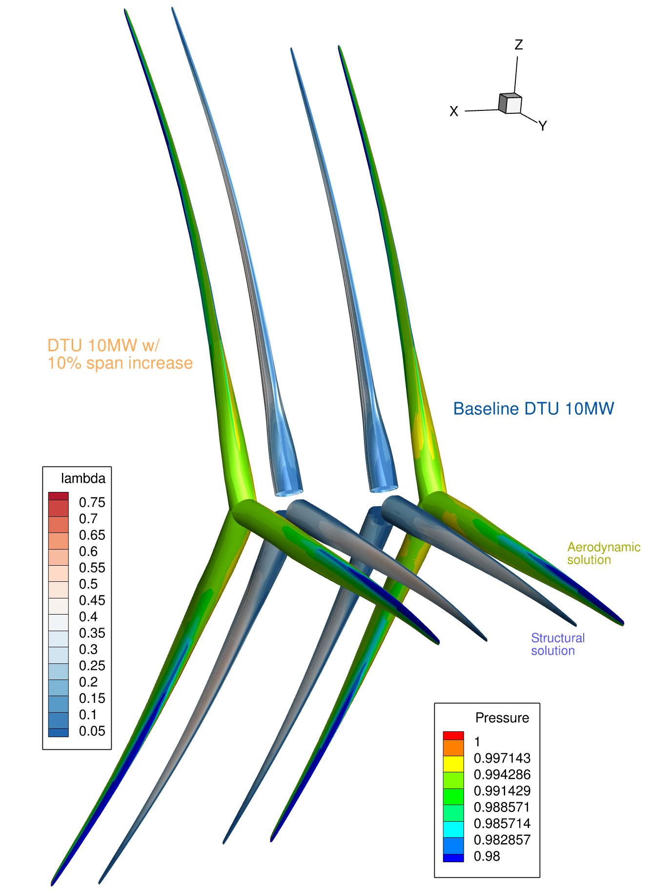 | Marco Mangano, __Sicheng He__, Denis-Gabriel Caprace, Yingqian Liao, and Joaquim R. R. A. Martins.    [__Passive aeroelastic tailoring of large wind turbines using high-fidelity multidisciplinary design optimization__](https://arc.aiaa.org/doi/abs/10.2514/6.2022-1289).    _In AIAA Scitech, San Diego, CA, January 2022. American Institute of Aeronautics and Astronautics_.|

## 5. Aerodynamic shape optimization with laminar-turbulent transition model

We apply gradient-based optimization to design more efficient airfoils with the laminar-turbulent transition modeled by the $e^n$ method. 
To compute derivatives with large number of design variables, we use the adjoint method.
One special challenge of the RANS with $e^n$ transition model is that we have the generalized eigenvalue problem embedded in the governing equation. 
We propose two approaches to address this challenge:

1. Using the simplified $e^n$ model that approximate the eigenvalues (Shi2020).
2. Developing an adjoint equation and reverse algorithmic differentiation (RAD) formulas for the generalized eigenvalue problem with complex coefficient matrices (He2022, Shi2022).
  
The tools we developed in the second approach turns out to be very general and they can be applied to any eigenvalue and eigenvector derivatives of generalized eigenvalue problems with complex coefficient matrices.
Besides, we also generalize the method to derive RAD formulas based on [dot-product-identity](https://people.maths.ox.ac.uk/gilesm/files/NA-08-01.pdf) proposed by Prof. Giles from real functions to complex analytic functions.

__Publication:__

|        |  |
|   :-:    | -       |  
| 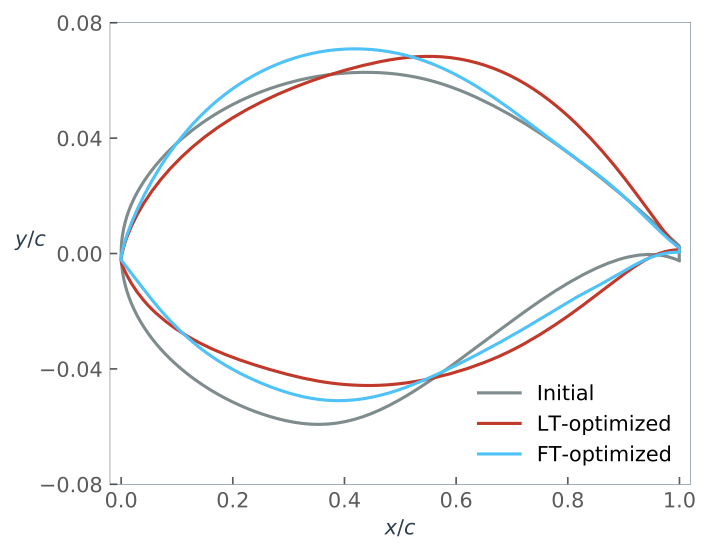 | Yayun Shi, Charles A. Mader, __Sicheng He__, Gustavo L. O. Halila, and Joaquim R. R. A. Martins.    [__Natural laminarflow airfoil optimization design using a discrete adjoint approach__](https://arc.aiaa.org/doi/10.2514/1.J058944s)     _AIAA Journal_ (2020).|
|  | __Sicheng He__, Yayun Shi, Eirikur Jonsson, and Joaquim R. R. A. Martins.    [__Eigenvalue problem derivatives computation for a complex matrix using the adjoint method__](../paper/eigen_der_complex.pdf)     Submitted to _Mechanical system and signal processing_.|

## 6. Structural global optimization using mixed integer linear and second order cone programming

The state-of-the-art design optimization in the field assumes that the structure is rigid and the coupling between the structure and fluid is neglected.
In effect, such assumptions become problematic as the size of the wind turbine increases to improve efficiency and the structure is becoming more flexible.
In addition, by considering the coupling effect, we can explore a larger design space and design more efficient wind turbines.
In this research, the pressing question we plan to address is: **How can we optimize the wind turbine design with both structural and aerodynamic shape variables and account for their coupling?**

To answer that question, we apply the MDO algorithms together with computational fluid dynamics (CFD) and finite element analysis (FEA) tools. 
The key finding of the research is that the aeroelastic coupling can be exploited to reduce the structure mass by about 2.2% compared with an optimized design without the coupling.
We obtained **the-first-of-it-kind** high-fidelity aerostructural optimization for wind turbines.
We are currently exploring using the composite to obtain passive load alleviation to further improve the performance of the wind turbine designs.
