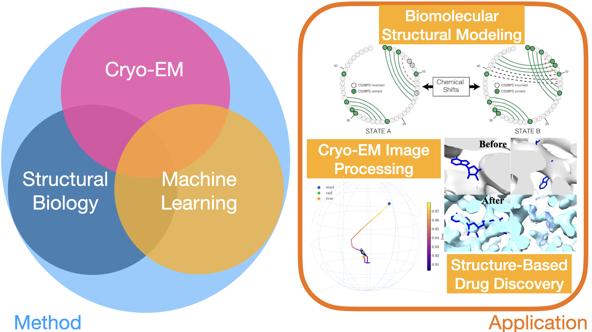

<!-- Check out my recent [presentation](https://github.com/SichengHe/MIT_LAE_seminar/blob/main/Sicheng_He_seminar.pdf)!-->

Table of content
- [Research vision](#research-vision)
- [Research projects](#research-projects)
  - [1. Multiscale modeling of RNA structures using NMR chemical shifts](#1-multiscale-modeling-of-rna-structures-using-nmr-chemical-shifts)
  - [2. _In situ_ cryo-EM single particle classification](#2-in-situ-cryo-em-single-particle-classification)
  - [3. 2DTM statistical metric for robust target detection](#3-2dtm-statistical-metric-for-robust-target-detection)
  - [4. Structure determination of sub-50 kDa complexes](#4-structure-determination-of-sub-50-kda-complexes)

# Research vision
My research focuses on developing quantitative models for cells, cellular compartments, and biochemical pathways using cryo-electron microscopy (cryo-EM) and tomography (cryo-ET). This interdisciplinary work is driven by a central goal: to uncover the mechanisms by which biomolecules perform specific cellular functions and to design and discover novel therapeutics. My research aims to revolutionize cryo-EM/ET image processing and quantitatively analyze experimental data using techniques from the fields of statistics and computer science.

The development of direct electron detectors (DEDs) and high-performance computing has enabled structure determination of purified macromolecules at atomic resolution through single-particle cryo-EM. Additionally, thinned cellular samples can be prepared by focused ion beam (FIB) and imaged via cryo-ET to reconstruct the 3D organization of cellular environments. However, the resolution of cryo-ET-derived tomograms remains limited, requiring subtomogram averaging to achieve high-resolution structures. To address this limitation, my research is driven by the following fundamental question: how do we maximize the information that can be extracted from images of radiation-sensitive biological samples to understand the structure-function relationship of biomolecules in cells?

Advancements in microscope hardware and image processing methods are required to improve signal-to-noise ratio and data throughput. My research lab will combine **numerical analysis** and **deep learning algorithms** to improve cryo-EM/ET data processing workflows. Specifically, building on the high-resolution 2D template matching (2DTM) approach developed in my postdoctoral lab, I will leverage the expanding repository of high-resolution structures and AlphaFold predictions as prior information to detect more challenging targets in images of diverse types of specimens.

    

My research lies on the interface of structural biology, visual proteomics, and machine learning. By accurately modeling the conformational states of biomolecules, we establish prior knowledge of their localization within cells, thereby deepening our understanding of their functions and advancing structure-based drug discovery.

# Research projects

## 1. Multiscale modeling of RNA structures using NMR chemical shifts

The central dogma of molecular biology states that genetic information is stored in DNA and passed to proteins by RNA. 
The proteins then carry out the cellular functions encoded by genetic information from DNA. 
Thus, for a long time, RNA was considered to be the intermediate of genetic information.
However, it was discovered that only 2\% of the human genome is translated into proteins, and the remaining transcripts are thought to be functional non-coding RNAs (ncRNAs). 
**To carry out biological functions, some ncRNAs may sample different conformational states and fluctuate between a ground state and transient states contingent on environmental conditions.** The structures of these transient RNA states provide significant information regarding their function. 

Solution state NMR has been the primary technique for RNA structure determination, and NMR-derived chemical shifts are considered structural “fingerprints” of RNA conformational state(s). **My PhD thesis aimed to develop computational methods to accurately model the structures (secondary structures in particular) of RNA conformational states**, including sparsely populated transient states, based on their chemical shift signatures. 

Accurately determining the structure of an RNA is the first step in studying its spatiotemporal properties. To address this challenge, I developed three computational frameworks - **CS-Fold**, **CS-BME**, and **CS-Annotate** - that utilize readily accessible NMR chemical shifts to achieve the following objectives: guiding _de novo_ RNA (secondary) structure prediction, probabilistically modeling the conformational landscape of RNA ensembles, and evaluating the quality of RNA structural models. These tools incorporate a variety of machine learning techniques.

<!-- [baseline](../images/research/baseline.gif)
-->

__Publication:__

|        |  |
|   :-:    | -       |  
|  | __Kexin Zhang__, Aaron T. Frank*.     [__Conditional Prediction of Ribonucleic Acid Secondary Structure Using Chemical Shifts__](https://pubs.acs.org/doi/full/10.1021/acs.jpcb.9b09814)     _The Journal of Physical Chemistry B_ (2019).|
|  | __Kexin Zhang__, Aaron T. Frank*.     [__Probabilistic Modeling of RNA Ensembles Using NMR Chemical ShiftsArticle__](https://pubs.acs.org/doi/10.1021/acs.jpcb.1c05651)     _The Journal of Physical Chemistry B_ (2021).|
|  | __Kexin Zhang__, Kyrillos Abdallah, Pujan Ajmera, Kyle Finos, Andrew Looka, Joseph Mekhael, Aaron T. Frank*.     [__CS-Annotate: A Tool for Using NMR Chemical Shifts to Annotate RNA Structure__](https://pubs.acs.org/doi/10.1021/acs.jcim.1c00006#:~:text=At%20its%20core%2C%20CS-Annotate,from%20their%20chemical%20shift%20fingerprint.)     _Journal of Chemical Information and Modeling_ (2021).|

## 2. _In situ_ cryo-EM single particle classification

<!-- -->

2DTM can be used to detect different 60S ribosome intermediates in images of FIB-milled yeast cells. I developed a maximum likelihood method that probabilistically models the identities of individual targets detected by 2DTM with multiple templates. This method allowed us to model the spatial distribution of different molecular populations in the cell and study the ribosome biogenesis pathway. This study was **the first to show** that 2DTM can be used for _in situ_ single particle classification without the need for 3D reconstruction.

__Publication:__

|        |  |
|   :-:    | -       |  
|  | Bronwyn A. Lucas*, __Kexin Zhang__, Sarah Loerch, Nikolaus Grigorieff*.    [__In situ single particle classification reveals distinct 60S maturation intermediates in cells__](https://elifesciences.org/articles/79272.)     _eLife_ (2022).|

## 3. 2DTM statistical metric for robust target detection

Detecting smaller targets by 2DTM remains difficult since the detected signal depends on the molecular weight of the target. Moreover, low-resolution contrast can be a reliable indicator of a target, but is down-weighted in the current 2DTM workflow. I addressed these challenges by developing a new statistical metric for 2DTM, **the 2DTM p-value**, that improves the detection of several **previously challenging** targets, including a 193 kDa clathrin monomer. We envision that the 2DTM p-value is useful for detecting targets of 50 kDa and smaller. We also believe that the p-value increases our ability to reliably detect rare targets that might require a higher detection threshold to lower the chances of false positives.

__Publication:__

|        |  |
|   :-:    | -       |  
|  | __Kexin Zhang__, Pilar Cossio, Aaditya V. Rangan, Bronwyn A. Lucas, Nikolaus Grigorieff*.    [__New Statistical Metric for Robust Target Detection in Cryo-EM Using 2DTM__](https://www.biorxiv.org/content/10.1101/2024.10.01.616095v1)     _bioRxiv (under review)_ (2024).|

## 4. Structure determination of sub-50 kDa complexes

<!---->

In **ongoing** research \cite{zhang2025improve}, I apply the newly developed 2DTM p-value to explore the molecular weight limit of cryo-EM. The key finding is that 2DTM improves the alignment of targets smaller than 50 kDa and reconstructs the cofactor-binding site with higher resolution. We envision that this method will push the lower molecular weight limit of single-particle cryo-EM, enabling the study of smaller drug-binding complexes and advancing structure-based drug design to new targets.