<!-- Check out my recent [presentation](https://github.com/SichengHe/MIT_LAE_seminar/blob/main/Sicheng_He_seminar.pdf)!-->

Table of content
- [Research vision](#research-vision)
- [Research projects](#research-projects)
  - [1. DiffPose: Differentiable pose optimization for cryo-EM images](#1-diffpose-differentiable-projection-matching-for-fast-pose-inference-in-cryo-em)
  - [2. GisAPR: Atomic model refinement directly against cryo-EM images](#2-gisapr-a-package-refines-atomic-models-against-cryo-em-images-without-3d-volumes)
  - [3. Improved reconstruction of sub-50 kDa complexes using 2D template matching](#3-improved-cryo-em-reconstruction-of-sub-50-kda-complexes-using-2d-template-matching-2dtm)
  - [4. Robust target detection in cryo-EM using high-resolution 2D template matching](#4-robust-target-detection-in-cryo-em-images-using-high-resolution-2d-template-matching-2dtm)
  - [5. _In situ_ single-particle classification in cryo-ET](#5-in-situ-cryo-em-single-particle-classification)
  - [6. Multiscale modeling of RNA structures using NMR chemical shifts](#6-multiscale-modeling-of-rna-structures-using-nmr-chemical-shifts)

# Research vision - Building Cryo-EM Foundation Models for Particle Detection and Structural Inference
My research is driven by a central question: **how can we transform cryo-EM into a predictive, data-driven science that explains cellular mechanisms and accelerates drug discovery?** To answer this, I develop computational methods that combine AI, statistical modeling, and cryo-EM physics to unlock structures that remain invisible to current pipelines. 

In the past decade, innovations in direct electron detectors (DEDs) and image processing methods has led to exponential growth in the biomolecular structures solved by cryo-EM. In single-particle cryo-EM, purified biomolecules are dispersed onto a support grid and rapidly frozen to form a thin layer of vitreous ice. The grid is then imaged in an electron microscope to record movies that are called "micrographs". Thousands of individual particle images of different views can be picked from noisy micrographs, aligned, and averaged to reconstruct the high-resolution 3D structure of the macromolecule. In additional to single-particle cryo-EM, thinned cellular samples can be prepared by focused ion beam (FIB) and imaged via cryo-ET to reconstruct the 3D organization of cellular environments to study the structure of biomolecules _in situ_. Since the so-called **resolution revolution** in 2013, cryo-EM has been used to determine the structures of many biomolecular structures that are not tractable with other methods.

Yet, major challenges remain: cryo-EM struggles with **small, flexible, or heterogeneous targets**, and cryo-ET datasets remain noisy, incomplete and difficult to interpret.

Advancements in microscope hardware and image processing methods are required to improve signal-to-noise ratio and data throughput. My research combines **numerical analysis** and **deep learning algorithms** to improve cryo-EM/ET data processing workflows. Specifically, building on the high-resolution 2D template matching (2DTM) approach developed in my postdoctoral lab, I will leverage the expanding repository of high-resolution structures and AlphaFold predictions as prior information to detect more challenging targets in images of diverse types of specimens.

    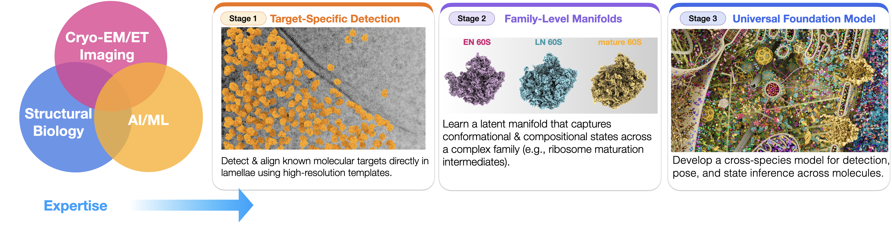

My research lies on the interface of cryo-EM, deep learning, and structural biology. By accurately modeling the conformational states of biomolecules, we establish prior knowledge of their localization within cells, thereby deepening our understanding of their functions and advancing structure-based drug discovery.

# Current (and past) research projects
## 1. DiffPose: Differentiable projection matching for fast pose inference in cryo-EM

  <!-- Left: trajectory -->
  <figure style="margin:0; max-width:600px; flex:1 1 360px;">
    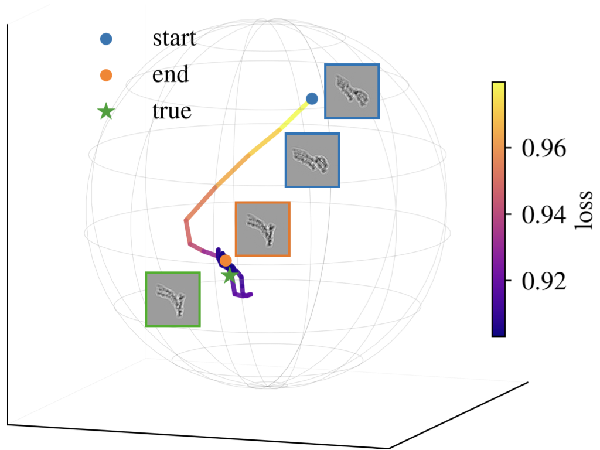
    <figcaption style="text-align:center; font-size:0.9em; margin-top:6px; opacity:0.8;">
      Pose optimization trajectory
    </figcaption>
  </figure>

  <!-- Right: GIF demo -->
  <figure style="margin:0; max-width:360px; flex:1 1 300px;">
    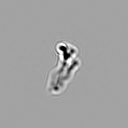
    <figcaption style="text-align:center; font-size:0.9em; margin-top:6px; opacity:0.8;">
      Local pose continuity
    </figcaption>
  </figure>

DiffPose is a differentiable framework that uses neural networks to accelerate pose inference and generalize across diverse imaging conditions. In our experiments, it achieves orders-of-magnitude faster performance than conventional grid search.

__Publication:__

**Kexin Zhang\***, Dongjie Zhu, Nikolaus Grigorieff\*  
[**DiffPose: Differentiable projection matching for fast pose inference in cryo-EM**](https://www.researchgate.net/publication/396499801_DiffPose_Differentiable_projection_matching_for_fast_pose_inference_in_cryo-EM)  
*ResearchGate, 2025*

## 2. GisAPR, a package refines atomic models against cryo-EM images without 3D volumes

In this project, we refine atomic coordinates directly against raw cryo-EM images, bypassing the traditional 3D reconstruction step.
More results coming soon, stay tuned!

__Publication:__

Dongjie Zhu&dagger;, <b>Kexin Zhang</b>&dagger;, Lingli Kong, Nikolaus Grigorieff*

[**GisAPR, a package refines atomic models against cryo-EM images without 3D volumes**](xxx)  
*In preparation, 2025*

## 3. Improved cryo-EM reconstruction of sub-50 kDa complexes using 2D template matching (2DTM)

    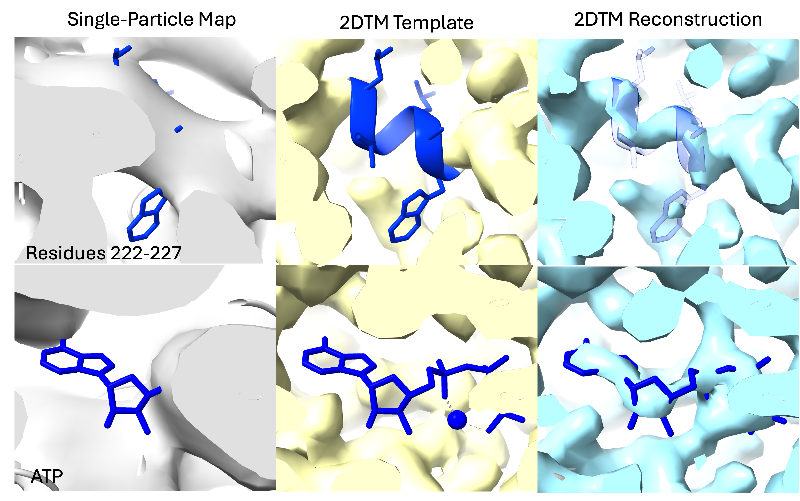

In this study, we extend single-particle cryo-EM to the sub-50 kDa regime by leveraging 2D template matching (2DTM) for accurate particle alignment and stringent particle selection. Applying our method to a previously published ~41 kDa catalytic domain of protein kinase A dataset, we demonstrate improved visualization of ligands and binding pockets compared to traditional workflows. We further present calculations suggesting that the molecular weight limit can be pushed to below 10 kDa with the combined use of a phase plate and liquid-helium cooling. Together, these findings establish a roadmap for making isolated small complexes tractable targets for high-resolution cryo-EM. 

__Publication:__

**Kexin Zhang\***, Timothy Grant, Nikolaus Grigorieff\*  
[**Improved cryo-EM reconstruction of sub-50 kDa complexes using 2D template matching**](https://doi.org/10.1101/2025.09.11.675606)  
_bioRxiv_ (2025). *Under Review*

## 4. Robust target detection in cryo-EM images using high-resolution 2D template matching (2DTM)

Detecting smaller targets by 2DTM remains difficult since the detected signal depends on the molecular weight of the target. Moreover, low-resolution contrast can be a reliable indicator of a target, but is down-weighted in the current 2DTM workflow. I addressed these challenges by developing a new statistical metric for 2DTM, **the 2DTM p-value**, that improves the detection of several **previously challenging** targets, including a 193 kDa clathrin monomer. We envision that the 2DTM p-value is useful for detecting targets of 50 kDa and smaller. We also believe that the p-value increases our ability to reliably detect rare targets that might require a higher detection threshold to lower the chances of false positives.

__Publication:__

|        |  |
|   :-:    | -       |  
| 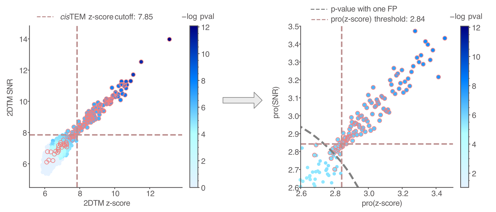 | __Kexin Zhang__, Pilar Cossio, Aaditya V. Rangan, Bronwyn A. Lucas, Nikolaus Grigorieff*.    [__A New Statistical Metric for Robust Target Detection in Cryo-EM Using 2D template matching__](https://doi.org/10.1107/S2052252524011771)     _IUCrJ_ (2025).|

## 5. _In situ_ cryo-EM single particle classification

<!-- 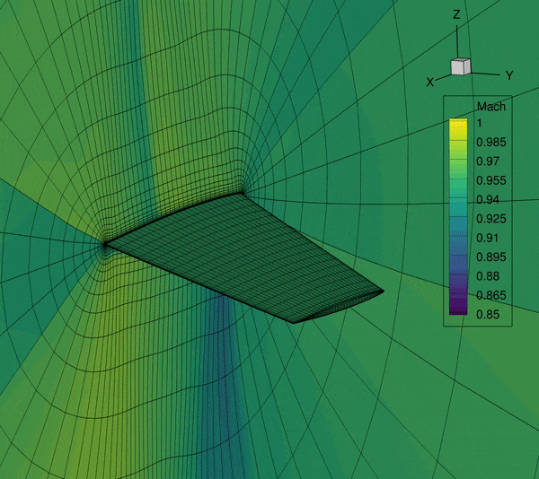-->

2DTM can be used to detect different 60S ribosome intermediates in images of FIB-milled yeast cells. I developed a maximum likelihood method that probabilistically models the identities of individual targets detected by 2DTM with multiple templates. This method allowed us to model the spatial distribution of different molecular populations in the cell and study the ribosome biogenesis pathway. This study was **the first to show** that 2DTM can be used for _in situ_ single particle classification without the need for 3D reconstruction.

__Publication:__

|        |  |
|   :-:    | -       |  
| 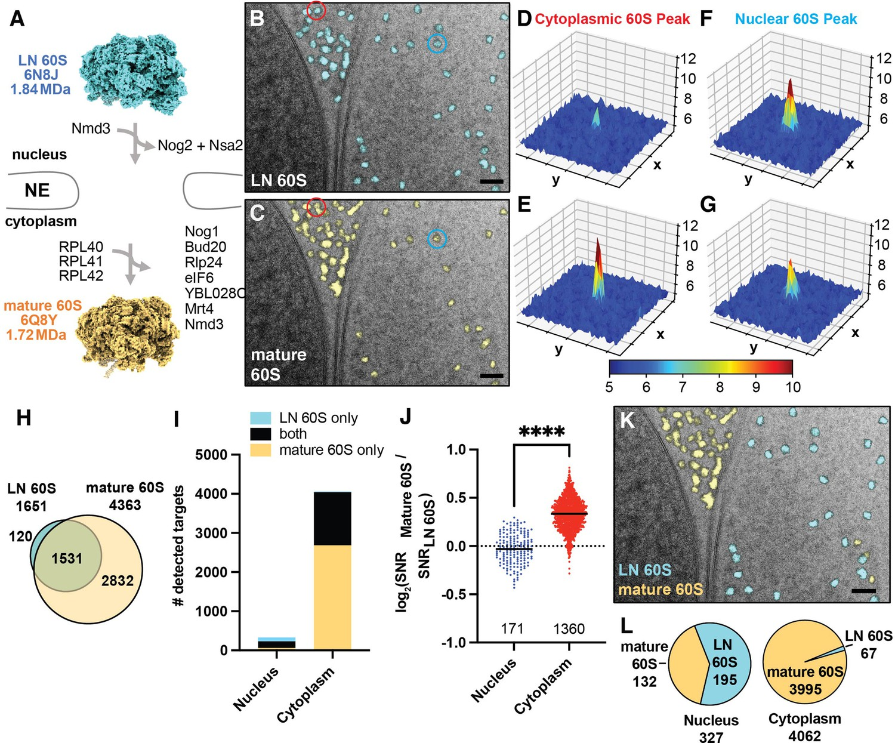 | Bronwyn A. Lucas*, __Kexin Zhang__, Sarah Loerch, Nikolaus Grigorieff*.    [__In situ single particle classification reveals distinct 60S maturation intermediates in cells__](https://elifesciences.org/articles/79272.)     _eLife_ (2022).|

## 6. Multiscale modeling of RNA structures using NMR chemical shifts

The central dogma of molecular biology states that genetic information is stored in DNA and passed to proteins by RNA. 
The proteins then carry out the cellular functions encoded by genetic information from DNA. 
Thus, for a long time, RNA was considered to be the intermediate of genetic information.
However, it was discovered that only 2\% of the human genome is translated into proteins, and the remaining transcripts are thought to be functional non-coding RNAs (ncRNAs). 
**To carry out biological functions, some ncRNAs may sample different conformational states and fluctuate between a ground state and transient states contingent on environmental conditions.** The structures of these transient RNA states provide significant information regarding their function. 

Solution state NMR has been the primary technique for RNA structure determination, and NMR-derived chemical shifts are considered structural “fingerprints” of RNA conformational state(s). **My PhD thesis aimed to develop computational methods to accurately model the structures (secondary structures in particular) of RNA conformational states**, including sparsely populated transient states, based on their chemical shift signatures. 

Accurately determining the structure of an RNA is the first step in studying its spatiotemporal properties. To address this challenge, I developed three computational frameworks - **CS-Fold**, **CS-BME**, and **CS-Annotate** - that utilize readily accessible NMR chemical shifts to achieve the following objectives: guiding _de novo_ RNA (secondary) structure prediction, probabilistically modeling the conformational landscape of RNA ensembles, and evaluating the quality of RNA structural models. These tools incorporate a variety of machine learning techniques.

<!-- [baseline](../images/research/baseline.gif)
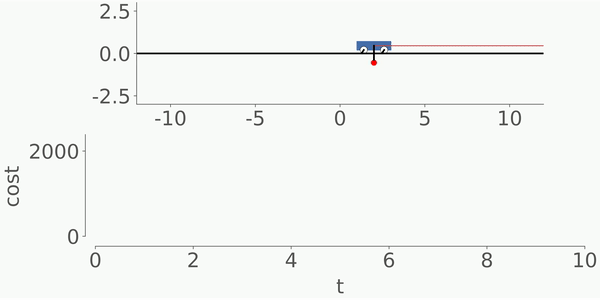-->

__Publication:__

|        |  |
|   :-:    | -       |  
| 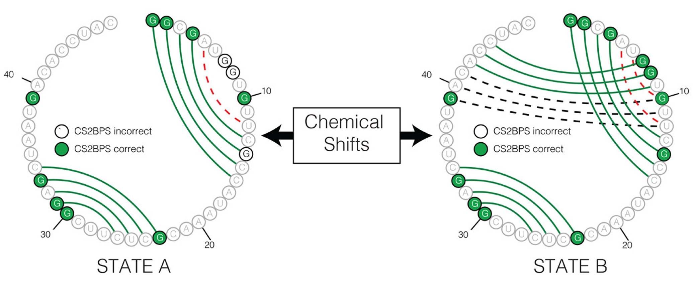 | __Kexin Zhang__, Aaron T. Frank*.     [__Conditional Prediction of Ribonucleic Acid Secondary Structure Using Chemical Shifts__](https://pubs.acs.org/doi/full/10.1021/acs.jpcb.9b09814)     _The Journal of Physical Chemistry B_ (2019).|
| 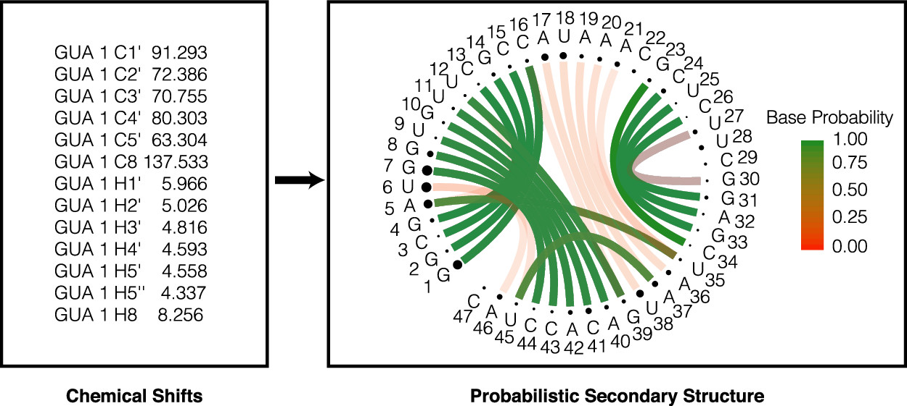 | __Kexin Zhang__, Aaron T. Frank*.     [__Probabilistic Modeling of RNA Ensembles Using NMR Chemical ShiftsArticle__](https://pubs.acs.org/doi/10.1021/acs.jpcb.1c05651)     _The Journal of Physical Chemistry B_ (2021).|
| 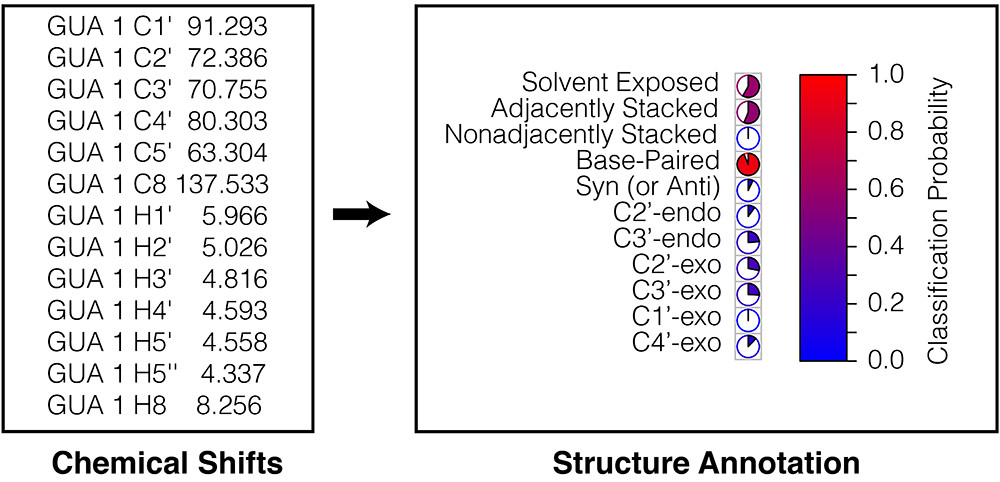 | __Kexin Zhang__, Kyrillos Abdallah, Pujan Ajmera, Kyle Finos, Andrew Looka, Joseph Mekhael, Aaron T. Frank*.     [__CS-Annotate: A Tool for Using NMR Chemical Shifts to Annotate RNA Structure__](https://pubs.acs.org/doi/10.1021/acs.jcim.1c00006#:~:text=At%20its%20core%2C%20CS-Annotate,from%20their%20chemical%20shift%20fingerprint.)     _Journal of Chemical Information and Modeling_ (2021).|