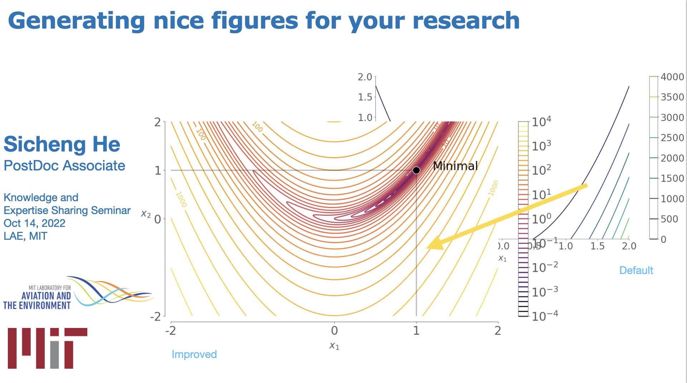

Recently, I organized a visualization workshop for about 20 students at LAE, MIT. 
Here are the slides and code for the workshop
[Visualization workshop, LAE, MIT](https://github.com/SichengHe/LAE_workshop)

Teaching experience:
* [AE 588, MDO](https://bulletin.engin.umich.edu/courses/aero/), Graduate student instructor (GSI). Instructor: [Prof. Joaquim R. R. A. Martins](https://aero.engin.umich.edu/people/martins-joaquim-r-r-a/).
* [ME 335, heat transfer](https://www.ji.sjtu.edu.cn/academics/courses/present-course-offerings/), undergraduate teaching assistant (TA). Instructor: [Prof. Qiang Zhang](https://www.linkedin.com/in/qiang-zhang-a9345a16/?originalSubdomain=uk).

